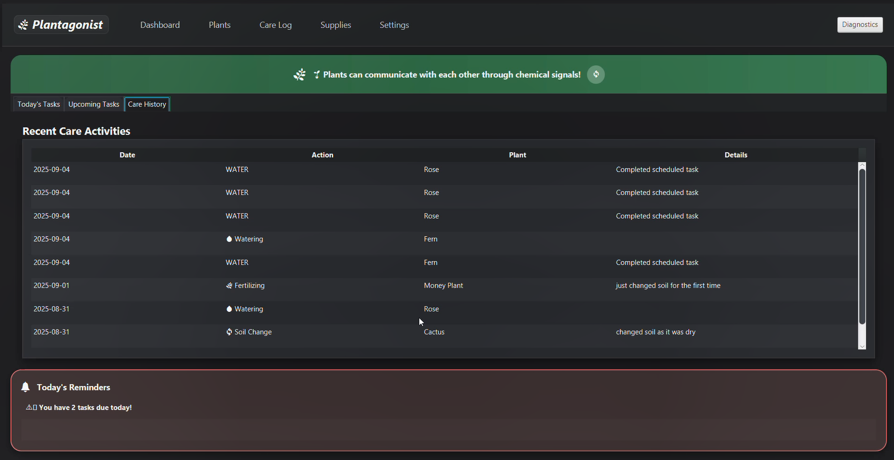

# 🌱 Plantagonist

Plantagonist is a desktop application built with Java and JavaFX designed for plant enthusiasts to help them build consistent plant care habits. It promotes sustainable urban living and mental well-being by aligning with SDG 15: Life On Land and SDG 3: Good Health and Well-Being.

---

## ✨ Features

  
- Plant Management: Add, update, and track individual plants with details.
- Care Task Scheduling: Assign and manage watering, pruning, or fertilizing tasks.
- Care Log: Maintain a historical record of plant activities.
- Journaling: Capture user experience and plant care journey
- Supply Tracking: Monitor gardening supplies.
- Weather-Aware Suggestions: Use external weather data to optimize plant care.
- User Authentication: Secure login and personalized plant collections.

---

## 📸 Glimpse

**Dashboard**

**Add Plant**

**Care Log**

**Supplies**

---
## 🛠️ Tech Stack

- Language: Java
- GUI: JavaFX, SceneBuilder, CSS
- Database: MongoDB + JSON (for user profiles)
- APIs: Weather API, Geolocation API
- Version Control : Git, GitHub
- Build Tool: Maven
- IDE : IntelliJ IDEA  
---

## 🚀 Getting Started

### Prerequisites

- Java 24
- IntelliJ IDEA (or any Java IDE)
- MongoDB installed locally or accessible via cloud
- Internet connection (for Weather API & Geolocation API)  

### Installation

Clone the repository:  
  
git clone [https://github.com/mahd149/plantagonist](https://github.com/mahd149/plantagonist)

  

1. Open the project in IntelliJ IDEA.
2. Configure MongoDB connection string in the project settings.
3. Run the application.  

---

## 🧑‍🤝‍🧑 Team Members

- Mahdi Islam (220041149)
- Maisha Sanjida (220041128)   
- Obidit Islam (220041154)  

Supervisor: Sabrina Islam

---

## 📜 License

This project is for academic purposes under course CSE 4402 - Visual Programming.

**
